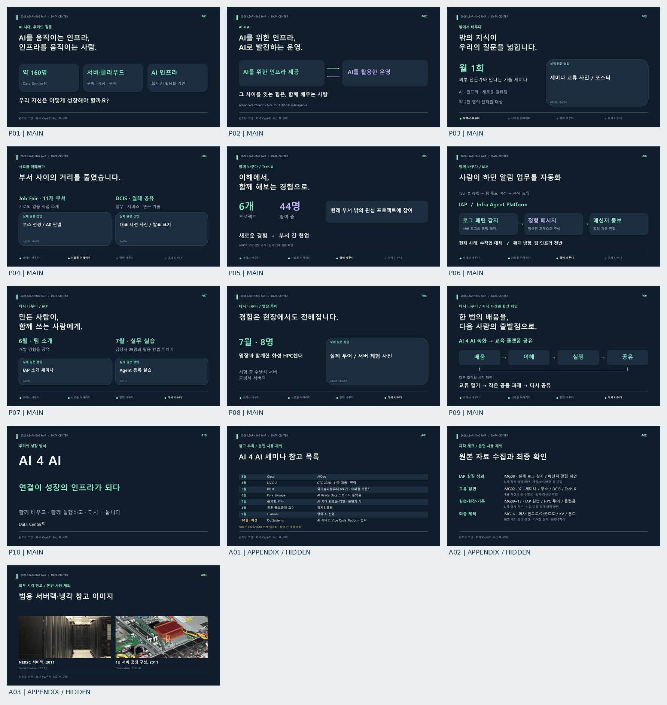

# 2026 Learning Fair — AI 4 AI

**연결이 성장의 인프라가 되다.** Data Center팀의 학습·교류·실행·재공유를 연결하는 5분 영상 제작 프로젝트다. 출연은 **류경동 팀장·이관우 교육담당**이다.

> 이 문서에서 해야 할 일: 콘셉트와 검토용 제작 패키지를 확인하고, 문서별 지시에 따라 내부 원본 확보·리허설·촬영·편집을 진행한다.

밖의 지식을 배우고, 서로의 일을 이해하고, 부서를 넘어 함께 실행하며, 그 경험을 다시 나눈다. Tech X에서 팀 주요 미션으로 확장된 **IAP**를 중심 사례로 보여준다. 서버 로그의 특정 패턴을 감지해 정해진 포맷의 메신저 알림을 자동 동보하는 실제 사례와, 팀 인프라 전반으로 확대하려는 방향을 구분한다.

## 바로 보는 제작 파일

- **2026-10-10 검토 제안:** [발표자 관점·새 콘셉트](docs/10-presenter-review.md) · [애니메이션 검토](docs/11-motion-review.md). 현재 v0.1과 비교할 개정 제안이다.
- [스토리라인과 콘셉트 후보](docs/02-concept-storyline.md)
- [편집 가능한 PPTX — 본편 10장·참고 부록 3장](deliverables/learning-fair-2026.pptx)
- [PPTX의 실제 PowerPoint 렌더 PDF](deliverables/learning-fair-2026.pdf)
- [장면별 콘티](docs/05-storyboard.md)
- [2인 촬영용 대본](docs/06-script.md)
- [발음 표기 프롬프터](deliverables/teleprompter.txt)
- [영상팀 전달 안내](docs/08-handoff.md)



## 제작 기준과 현재 상태

**검토용 초안 v0.1 · 2026-10-09.** 전체 타임라인은 회사 인트로 5초 → AI 팀 소개 15초 → 본편 275초 → 회사 아웃트로 5초, 합계 300초다. 스튜디오 본편은 발음 환산 1,012음절이며 느린 속도와 기본 호흡을 포함해 약 263초로 추정한다. 리허설 실측은 아직 없다.

심사위원에게는 학습문화와 **IAP의 미션 확장·운영 도입·수작업 대체·실습 전달**을 보여준다. 온라인 투표에는 **Tech X의 새로운 경험·부서 간 교류**와 다른 조직도 시작할 수 있는 운영 방식을 남긴다. 실제 타 조직 확산 완료나 미측정 시간 절감을 주장하지 않는다.

내부 사진·실제 IAP 화면·회사 KV는 미수급이므로 PPTX에 필요한 원본을 지정했다. 10월 OutSystems 세미나는 현재 미개최이며 촬영 전 개최 예정이다. 별도 15초 AI 영상은 제작 브리프만 있고 영상 파일은 없다. 전문 영상팀이 촬영·편집하는 단계는 이 패키지 이후다.

## 문서 안내

| 문서 | 해야 할 일 |
| --- | --- |
| [00 제작 지침](docs/00-production-guidelines.md) | 범위·서사·사실·시간·납품 조건 고정 |
| [01 실행 지침](docs/01-work-plan.md) | 작업별 입력·산출물·검수·진행 상태 확인 |
| [02 콘셉트](docs/02-concept-storyline.md) | 추천안과 대안 비교, 서사·평가 근거 검토 |
| [03 사실과 원본](docs/03-facts-and-assets.md) | 제공 사실·실제/예정·필요 이미지와 증빙 확인 |
| [04 웹 참고](docs/04-web-references.md) | 공식 출처 15건과 외부 사진 3장의 활용·권리 확인 |
| [05 콘티](docs/05-storyboard.md) | 300초 타임라인과 자료·카메라·효과 매칭 |
| [06 대본](docs/06-script.md) | 실제 발화·자료 큐 리허설 |
| [07 AI 소개](docs/07-ai-intro-brief.md) | 15초 3컷 영상·자막·연결 제작 |
| [08 전달](docs/08-handoff.md) | 영상팀 전달·원본 교체·촬영 준비 |
| [09 검수](docs/09-validation.md) | 검수 근거와 남은 제작 단계 확인 |
| [10 발표자 검토](docs/10-presenter-review.md) | 상투성·구성·두 화자의 역할과 추천 개정안 비교 |
| [11 애니메이션 검토](docs/11-motion-review.md) | 발화에 필요한 모션·전환·시간 포함 관계 확인 |

## 파일 구조

```text
docs/                 제작 지침·콘셉트·사실·콘티·대본·전달·검수
content/film.json     발화·시간·자료 큐의 기준 데이터
assets/references/   외부 시각 참고 원본·출처·라이선스
deliverables/        PPTX·PDF·프롬프터·리허설 CSV·검수 보고서
deliverables/preview/ PowerPoint에서 렌더한 실제 장표 PNG·전체 미리보기
scripts/             자료 재생성·실제 렌더·구조/일치 검수
```

## 재생성과 검수

Python 3.11 이상에서 저장소 루트 기준으로 실행한다. 현재 실행 환경은 Python 3.13이다.

```bash
uv venv .venv
uv pip install --python .venv/bin/python -r requirements.txt
.venv/bin/python scripts/build_package.py
bash scripts/render_slides.sh
.venv/bin/python scripts/validate_package.py
```

`uv`가 없다면 `python3 -m venv .venv`와 `.venv/bin/python -m pip install -r requirements.txt`로 같은 환경을 만든다. Python 빌드는 플랫폼에 종속되지 않지만, 자동 렌더 명령은 현재 WSL + Windows Microsoft PowerPoint를 사용한다. 다른 환경에서는 PowerPoint로 PDF와 PNG를 동일 경로에 내보낸다. 수정 이후에도 발표자 노트·대본·자료 번호가 맞는지 검사한다.

`content/film.json`을 수정하면 콘티·대본·PPTX·프롬프터·시간 보고서를 함께 갱신할 수 있다. 콘셉트·사실·웹 출처·전달·검수 요약은 사람이 검토해 반영한다. 리허설 CSV의 실측·메모는 재생성해도 유지된다. 출처 URL·이미지 권리·원본 해시는 `assets/references/manifest.json`에 기록했다.

## 저장소

사용자 요청에 따라 [leerazor/edu](https://github.com/leerazor/edu)의 `main`에 모든 제작 산출물을 저장한다. 가상환경·인증정보·임시 파일은 제외한다. 후속 변경도 같은 브랜치에 기록하며 기존 이력을 보존한다.
